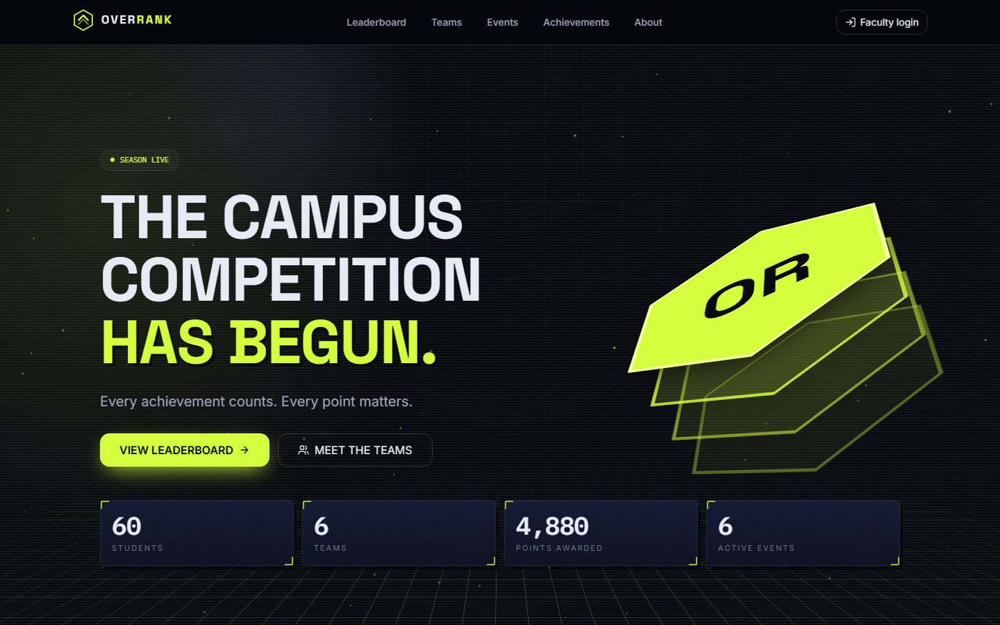
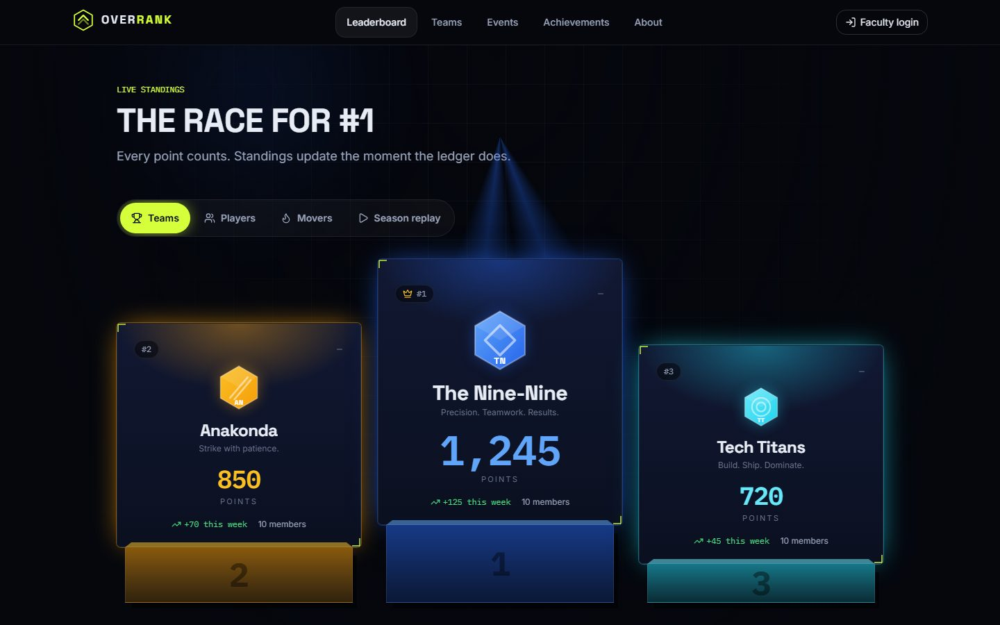
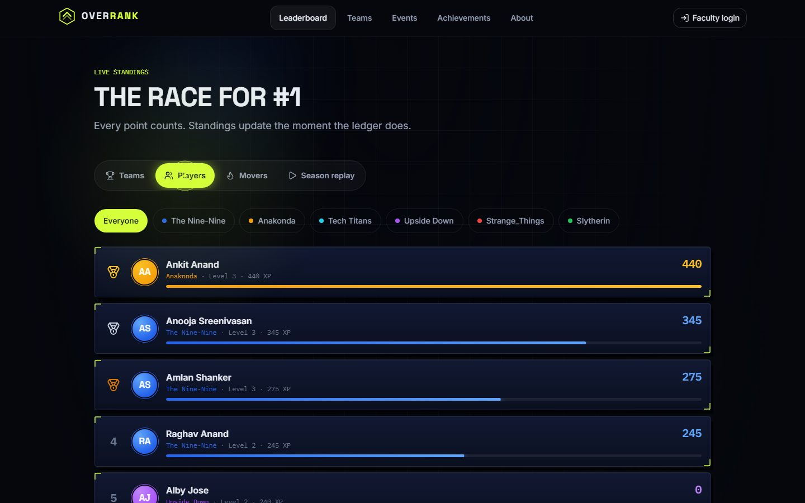
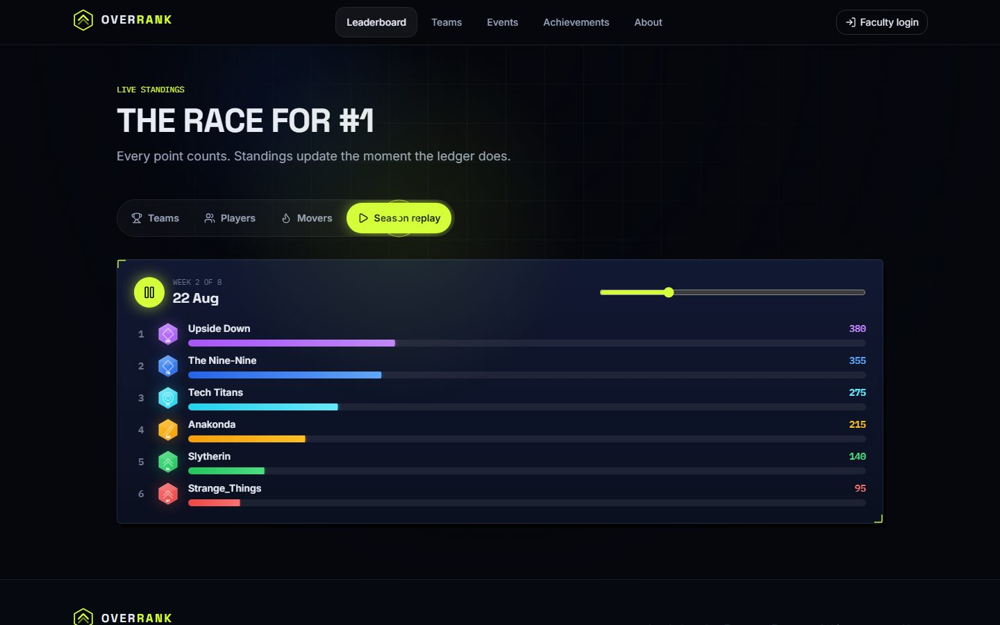
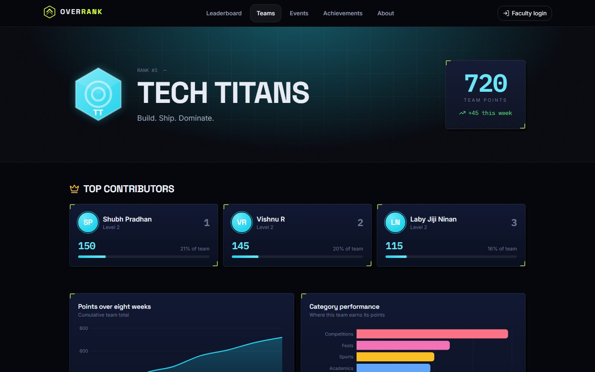
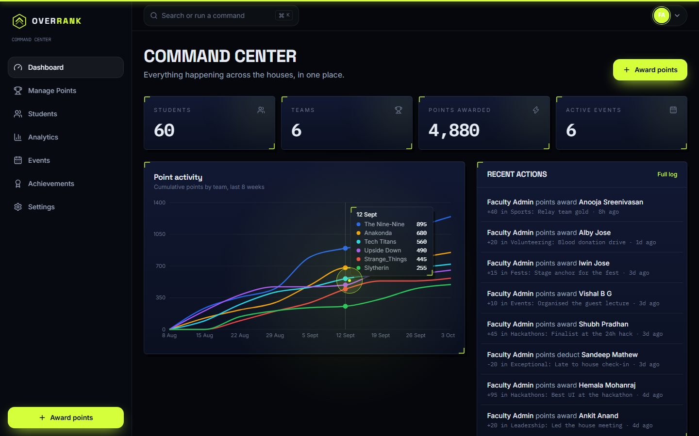
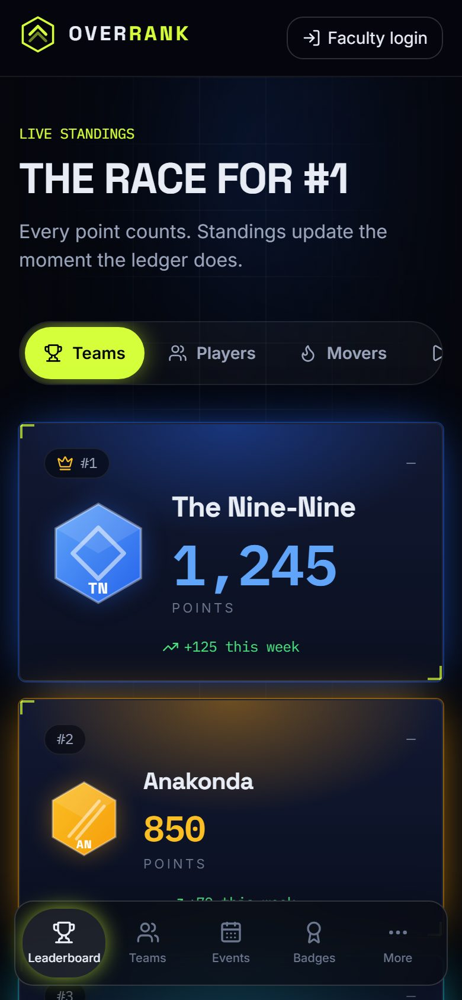
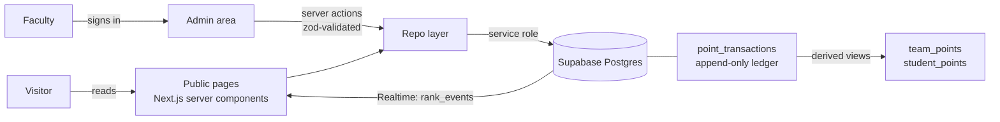

<div align="center">

# OVERRANK

**A live house-competition platform for campuses.** Teams earn points, the leaderboard reacts in real time, and faculty run the whole season from one command center.

[](https://github.com/Kaushik2210/Overrank/actions/workflows/ci.yml)
[](LICENSE)


[**Live site**](https://overrank.vercel.app) · [Deployment guide](docs/DEPLOYMENT.md) · [Security](SECURITY.md)



</div>

---

## What it is

OVERRANK turns a college house or team competition into something people want to watch. Students are split into teams. Faculty award or deduct points for academics, sports, hackathons, volunteering and anything else they define. The public leaderboard updates the moment the ledger does.

- **Students never sign in.** The leaderboard, team pages, player profiles, events and achievements are public and read-only.
- **Only faculty sign in**, to award points, run events and manage the roster.
- **Every point is on the record.** The ledger is append-only. A mistake is fixed with a compensating entry, never by rewriting history.

## Screenshots

| Leaderboard | Players |
| :--: | :--: |
|  |  |
| **Season replay** | **Team page** |
|  |  |
| **Faculty command center** | **Mobile** |
|  |  |

*Screenshots use invented demo data. A real season starts at 0 points.*

## Features

**For everyone**
- Live leaderboard with a 3D podium, ranked team cards, and an animated overtake banner when one team passes another
- Pre-season **starting grid** instead of a misleading tied podium while nobody has scored
- Four views: Teams, Players (filter by team), Movers (weekly gainers) and a playable **Season replay**
- Team pages with top contributors, category breakdown, charts, achievements and a timeline
- Player profiles with level, XP, progress rings and badges
- Events with live, upcoming and past states, countdowns and winners
- Achievements gallery with rarity tiers and unlock rules

**For faculty**
- Command center: stats, point-activity chart, latest transactions, top performers and an audit trail
- **Award points** to one student or a whole team, with category, reason, optional event and evidence upload
- Searchable, filterable, sortable ledger with CSV export (formula-injection safe) and one-click reversals
- Event management with winners that can trigger point awards
- Achievement rules: manual, points threshold or category threshold
- Roster import from CSV with a preview and validation step
- Editable team names, colours, mottos, point categories and the XP formula
- Command palette (`Ctrl/Cmd + K`)

**Experience**
- Scroll-driven 3D hero, interactive season race, live results ticker, tilt cards, magnetic buttons
- Respects `prefers-reduced-motion`, and offers its own motion and sound settings (sound is off by default)
- Responsive layouts from 320px phones to 1920px displays, with a floating bottom nav on mobile

## How it works



- **Totals are derived, never stored.** Team and student scores come from views over the ledger, so they cannot drift.
- **Points only change through two database functions** (`award_points`, `reverse_transaction`). They verify the caller's role and are callable by the service role only, so a browser can never mint points.
- **A repo layer** (`src/lib/data`) sits between the UI and storage. With Supabase configured it reads and writes Postgres. Without it, an in-memory store lets you run the whole app locally.

## Tech stack

| Area | Choice |
| --- | --- |
| Framework | Next.js 16 (App Router), React 19, TypeScript (strict) |
| Styling | Tailwind CSS 4 with design tokens as CSS variables |
| Motion | Motion (`motion/react`), transform and opacity only |
| Data | Supabase: Postgres, Auth, Row Level Security, Realtime, Storage |
| Validation | zod on every input, react-hook-form on forms |
| Charts | Recharts, restyled, lazy-loaded |
| Tests | Vitest, PGlite (real Postgres in WASM) for migrations and RLS, Playwright |

## Getting started

Requires Node 22 or newer.

```bash
git clone https://github.com/Kaushik2210/Overrank.git
cd Overrank
npm install
npm run dev:preview
```

Open <http://localhost:3100>. **Preview mode** needs no accounts or keys: it runs the full app from `data/roster.json` with every team at 0 points, and the faculty button signs you in without a password. Data lives in memory and resets when the server restarts.

To see it with invented activity, run `OVERRANK_DEMO=1 npm run dev:preview` (on Windows PowerShell: `$env:OVERRANK_DEMO=1; npm run dev:preview`).

### Running against Supabase

1. Create a Supabase project and run the SQL files in [`supabase/migrations`](supabase/migrations) in order.
2. Copy `.env.example` to `.env.local` and fill in the project URL and keys.
3. Seed the roster and create the faculty admin:
   ```bash
   npm run seed
   ```
4. `npm run dev`

The full walkthrough, including auth URL settings and Vercel, is in [docs/DEPLOYMENT.md](docs/DEPLOYMENT.md).

### Environment variables

| Variable | Required | Purpose |
| --- | --- | --- |
| `NEXT_PUBLIC_SUPABASE_URL` | for Supabase | Project URL |
| `NEXT_PUBLIC_SUPABASE_ANON_KEY` | for Supabase | Public anon key |
| `SUPABASE_SERVICE_ROLE_KEY` | for Supabase | Server-only key. Never expose it to the browser |
| `ADMIN_EMAIL`, `ADMIN_PASSWORD` | for `npm run seed` | Creates the faculty admin. A password is generated and printed once if left empty |
| `SESSION_SECRET` | deployed preview | Stable cookie-signing key |
| `PREVIEW_ADMIN_PASSWORD` | deployed preview | Password gate for preview sign-in in production |
| `OVERRANK_DEMO` | optional | `1` loads invented demo activity in preview mode |
| `OVERRANK_DOH` | optional, dev only | `1` resolves Supabase over DNS-over-HTTPS on networks that block it |

## Scripts

| Command | What it does |
| --- | --- |
| `npm run dev` | Dev server (Supabase if configured) |
| `npm run dev:preview` | Dev server in preview mode, ignoring any Supabase config |
| `npm run build` / `npm start` | Production build and server |
| `npm run typecheck` / `npm run lint` | Static checks |
| `npm test` | Unit and database tests |
| `npm run test:e2e` | Playwright end-to-end tests |
| `npm run seed` | Seed teams, students, categories, achievements and the admin account |
| `npm run seed:demo` / `seed:demo:clear` | Load or remove flagged demo data |
| `node scripts/smoke-live.mjs` | Read-only smoke test of a deployed site |

## Testing

- **Unit tests** cover XP and levels, ranking, validators, the CSV parser and the repo's award, reversal and roster logic.
- **Database tests** apply the real migrations to Postgres (via PGlite) and check the append-only ledger, derived totals, the award and reverse functions, and Row Level Security for anonymous visitors, signed-in strangers, faculty and the service role.
- **Seed tests** load the generated demo data into Postgres and assert the database totals equal the application's own calculations.
- **End-to-end tests** drive a real browser through the public site, the locked admin area and the faculty flows.

```bash
npm test
npm run test:e2e
```

## Security model

- Row Level Security is on every table. Anonymous visitors can read only public reference data and the leaderboard view.
- The ledger rejects edits and deletes at the database level. Only rows flagged as demo data can be removed.
- Evidence uploads are validated by size and file signature, stored in a private bucket and served through short-lived signed URLs.
- Sign-in and password-reset endpoints are rate limited, and reset requests never reveal whether an email has an account.
- Every faculty action is written to an audit log.

See [SECURITY.md](SECURITY.md) to report a vulnerability.

## Project structure

```
src/
  app/              routes: (site) public, (admin) faculty, api, login
  components/       ui, leaderboard, gamification, admin, charts, fx, nav
  lib/
    data/           repo interface, Supabase and in-memory implementations
    actions/        server actions (validated, rate limited, audited)
    supabase/       client helpers
supabase/migrations schema, RLS and RPC functions, storage bucket
scripts/            seed, demo data, smoke test, screenshots
tests/              unit, database (PGlite) and end-to-end suites
docs/               deployment guide and screenshots
```

## Known limitations

- Preview mode keeps data in memory, so it resets on restart and is not meant for a real season.
- The interface is dark-only.
- Automated accessibility auditing and Lighthouse budgets are not wired into CI yet.

## License

[MIT](LICENSE) © 2026 Kaushik
